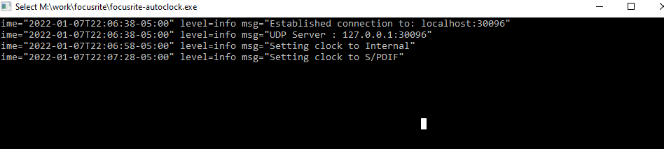
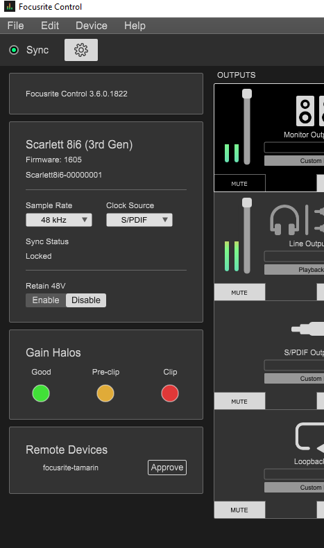

# Focusrite auto clock

## Why
When using digital(S/PDIF) inputs to Focusrite consumer audio interfaces, you have the choice of an internal or S/PDIF clock source.  

A number of S/PDIF input sources(Fractal AxeFx or Kemper) must be the master clock, and will result in pops and clicks if the internal clock is used.

When using the S/PDIF clock source, if that S/PDIF source is turned off, no audio will be output from any source to the monitor outputs.

This is a minor annoyance, more so when the focusrite is the primary audio interface.  Focusrite control can be used to switch to the internal clock when the S/PDIF source is unavailable.

The bigger nuisance comes in remembering to restore the S/PDIF clock source when the source is powered up, only recognizing this after recordings have been ruined with timing jitters.

TLDR; I don't want to fiddle with focusrite control when powering up/down my Axe Fx or Kemper.

## How
This program works as a client to the focusrite-control(must be running somewhere on your network) server to evaluate the current clock state

Every 5 seconds
* If the clock is set to S/PDIF< and the clock isn't locked, clock is set to Internal.  
* If the clock is set to internal and S/PDIF input has some input, it will set the clock to S/PDIF.

### Don't use this code, it's likely dangerous, you might discover a UDP service and get bad input.

## Building
Build for your platform of choice

`go ./src/. -o focusrite-autoclock`

## Running
Run on any host that can reach focusrite control(on your local network)

### Approve in focusrite control, allow the remote device in focusrite control under settings, remote devices

### Options  
 -h UDP discovery hostname, defaults to localhost
### Examples 
#### Discover focusrite control on localhost
`./focusrite-autoclock`
#### Discover focusrite control on host named elvis
`./focusrite-autoclock -h elvis`

### Releases
GH actions should build releases for MacOS / Windows / Linux / Linux Arm
